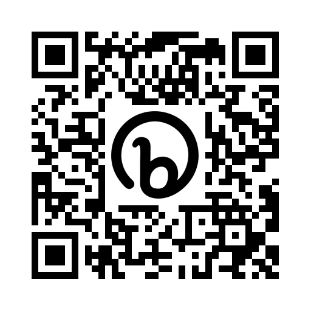
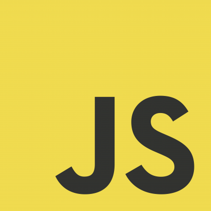
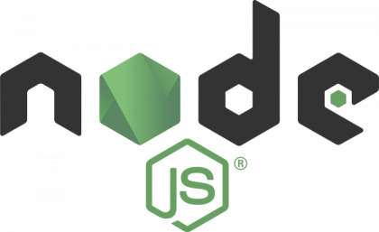

<h1 align="center">Hi, I'm Gabriel Gomez. 👋</h1>
<h3 align="center">Web developer 🌐, Bootcamp graduate🎓, fast learner⚡, hungry for challenges💪‍.</h3>

#
- 🌱 I’m currently learning more on **Typescript, React, Redux, RxJS, Style-components**

- 👨‍💻 All of my projects are available at [https://github.com/gabriel-vcs](https://github.com/gabriel-vcs)

- :inbox_tray: Reach me at: **ggomez.estevez@gmail.com** 

- :open_file_folder: Find my LinkedIn profile at [https://www.linkedin.com/in/gabrielgomezestevez](https://www.linkedin.com/in/gabrielgomezestevez)

- :memo: Get my resume at [https://bit.ly/GABRIEL_GOMEZ_CV](https://bit.ly/GABRIEL_GOMEZ_CV) or scanning this QR Code: 

#
<h3 align="left">Languages and Tools:</h3>

&nbsp; &nbsp; &nbsp; &nbsp;

<!--
**gabriel-vcs/gabriel-vcs** is a ✨ _special_ ✨ repository because its `README.md` (this file) appears on your GitHub profile.

Here are some ideas to get you started:

- 🔭 I’m currently working on ...
- 🌱 I’m currently learning ...
- 👯 I’m looking to collaborate on ...
- 🤔 I’m looking for help with ...
- 💬 Ask me about ...
- Get my resume: bit.ly/3OfpuY0
- 📫 How to reach me: ...
- 😄 Pronouns: ...
- ⚡ Fun fact: ...
-->
